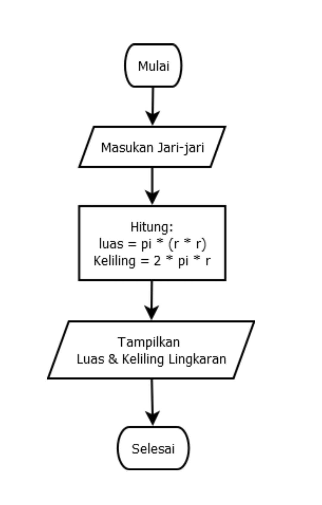

Patikum3

| Nama  | M Muammar |
| Nim   | 312210663 |
| Kelas | Ti.22.B1  |

## Menghitung luas dan keliling lingkaran

Flowchart luas dan keliling lingkaran

## Kode menghitung luas dan keliling lingkaran menggunakan python

masukan nilai jari-jari sesuai keinginan.
saya contoh pakai nilai 12.

_Hasil kode penghitungan luas dan keliling lingkaran diatas_

program diatas saya mengimport modul _math_ yang sudah disediakan oleh Python. Fungsinya supaya saya dapat menyertakan nilai phi yang sudah tersedia dalam modul tersebut dengan perintah __math.pi__ jika kita coba mencetak fungsi tersebut maka akan menghasilkan nilai 3.14

output pi

Selanjutnya kita memerlukan nilaijari-jari(r) yang nanti akan dimasukan oleh pengguna pada layar console. Kita menggunakan fungsi __input()__ yang nilainya di konversi ke type data float(bilangan rill).Ingat bahwa fungsi input() akan menganggap semua nilai inputan bertipe string, sehingga kita perlu melakukan konversi ke type yang diinginkan.
Ketika kita sudah menemukan nilai phi dan jari selanjutnya kita bisa menghitung luas dan keliling lingkaran sesuai rumusnya masing-masing.